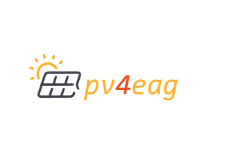

## Ongoing Projects

  <!-- Project dts -->
  

    

      

        

          

            
          

          

            

              <h5 class="card-title">dTS - Data Driven Tourism for sustainibility</h5>
              

                <strong>Funded by:</strong> Austrian Research Promotion Agency (FFG), Federal Ministry of Climate Action, Env, Energy, Mobility, Innovation and Tech.  
                <strong>Project No:</strong> FO999887513  
                <strong>Duration:</strong> 2021-2024  
                <strong>Budget:</strong> 728k EUR (overall), 173k EUR (TU Graz) 
                
                <strong>Role:</strong> Project writeup, Project key scientist 
              

              <a href="https://project-dts.eu/" class="btn btn-primary" target="_blank">Learn More</a>
            

          

        

      

    

  

  <!-- Project Geocrow -->
  

    

      

        

          

            
          

          

            

              <h5 class="card-title">GeoCrow - GeoSemantic and Crowdsourced enhanced Virtual Reality for Situational Awareness“</h5>
              

                <strong>Funded by:</strong> Austrian Research Promotion Agency (FFG)  
                <strong>Project No:</strong> FO999895161  
                <strong>Duration:</strong> 2023-2025  
                <strong>Budget:</strong> 610k EUR  
                <strong>Role:</strong> Project writeup, Project key scientist 
              

              <a href="https://www.geocrow-project.info/" class="btn btn-primary" target="_blank">Learn More</a>
            

          

        

      

    

  

  <!-- Project ignite -->
  

    

      

        

          

            
          

          

            

              <h5 class="card-title">IGNITE - Improved Assessment of Forest Fire Susceptibility</h5>
              

                <strong>Funded by:</strong> Waldfonds Austria (Federal Ministry for Agriculture, Regions and Tourism)  
                <strong>Duration:</strong> 2022-2025  
                <strong>Budget:</strong> 379k EUR (overall), 63k EUR (TU Graz)  
                <strong>Role:</strong> Project writeup, Project key scientist 
              

              <a href="https://geoinfo-tugraz.github.io/projects/IGNITE/" class="btn btn-primary" target="_blank">Learn More</a>
            

          

        

      

    

  

  <!-- Project abm4ET -->
  

    

      

        

          

            
          

          

            

              <h5 class="card-title">ABM4EnergyTransition - Agent-based Simulation of Transition Scenarios for regional Heating and Energy Transformation</h5>
              

                <strong>Funded by:</strong> Austrian Research Promotion Agency (FFG),AI for Green 2021  
                <strong>Project No:</strong> FO999892237  
                <strong>Duration:</strong> 2022-2024  
                <strong>Budget:</strong> 489k EUR  
                <strong>Role:</strong> Project writeup, Project key scientist 
              

              <a href="https://geoinfo-tugraz.github.io/projects/ABM4EnergyTransition/" class="btn btn-primary" target="_blank">Learn More</a>
            

          

        

      

    

  

  <!-- Project cagis -->
  

    

      

        

          

            
          

          

            

              <h5 class="card-title">Modeling and Visualizing the Extents of Historical Regions</h5>
               

                <strong>Funded by:</strong> Cartography and Geographic Information Society (CaGIS), CaGIS Rising Grant Program 2021  
                <strong>Duration:</strong> 2022-2024  
                <strong>Partners:</strong> Karl Grossner ((University of Pittsburgh) and Eric Delmelle (University of North Carolina at Charlotte)  
                <strong>Budget:</strong> $9,848  
                <strong>Role:</strong> Project writeup, Project Co-PI
              

              <a href="https://geoinfo-tugraz.github.io/projects/historical_regions/" class="btn btn-primary" taget = "_blank">Learn More</a>
            

          

        

      

    

  
  

## Completed Projects

  <!-- Project pv4eag -->
  

    

      

        

          

            
          

          

            

              <h5 class="card-title">Analysis Of Area And Energy Potential Using AI For Alternative PV Systems as aContribution To The EAG“</h5>
              

                <strong>Funded by:</strong> Austrian Research Promotion Agency (FFG)  
                <strong>Duration:</strong> 2022-2023  
                <strong>Role:</strong> Project writeup, Project Partner 
              

              <a href="https://www.fh-joanneum.at/projekt/pv4eag/" class="btn btn-primary" target="_blank">Learn More</a>
            

          

        

      

    

  

