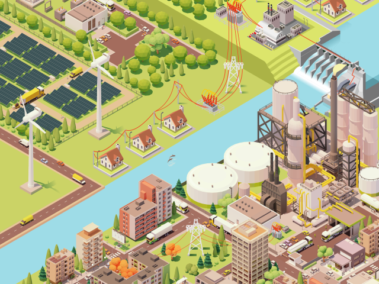




<!-- 
 -->

## Ongoing Projects

  <!-- Project dts -->
  

    

      

        

          

            
          

          

            

              <h5 class="card-title">dTS - Data Driven Tourism for sustainibility</h5>
              

                <strong>Funded by:</strong> Austrian Research Promotion Agency (FFG), Federal Ministry of Climate Action, Env, Energy, Mobility, Innovation and Tech.  
                <strong>Project No:</strong> FO999887513  
                <strong>Duration:</strong> 2021-2024  
                <strong>Budget:</strong> 728k EUR (overall), 173k EUR (TU Graz) 
                <strong>Role:</strong> Project writeup, Project key scientist  
                <strong>Skills:</strong>
                

                  

                    
Mobility analysis

                    
Tourist flow simulation modeling

                    
Prediction of next PoI

                    
Combining ABM and AI

                  

                

            

              

              <!-- Debugging output -->
              <!-- 
Publications: {{ publications | jsonify }}

              
Project : {{ project_publications| jsonify }}
 -->
              <!-- Related Publications -->
              <!-- 
<strong>Related Publications:</strong>

              <ul>
                
                  
                  <li><a href="{{ publication.url }}">{{ publication.title }}</a></li>
                
              </ul> -->
          

        

        

      

    

  

  <!-- Project Geocrow -->
  

    

      

        

          

            
          

          

            

              <h5 class="card-title">GeoCrow - GeoSemantic and Crowdsourced enhanced Virtual Reality for Situational Awareness“</h5>
              

                <strong>Funded by:</strong> Austrian Research Promotion Agency (FFG)  
                <strong>Project No:</strong> FO999895161  
                <strong>Duration:</strong> 2023-2025  
                <strong>Budget:</strong> 610k EUR  
                <strong>Role:</strong> Project writeup, Project key scientist 
              

              
<strong>Skills:</strong>

              

                

                  
NLP

                  
Geoparsing

                  
Mordecai

                  
Geoparsepy

                  
Knowldge graphs

                  
Semantic enrichment

                

              

            

        

      

    

  

  <!-- Project ignite -->
  

    

      

        

          

            
          

          

            

              <h5 class="card-title">IGNITE - Improved Assessment of Forest Fire Susceptibility</h5>
              

                <strong>Funded by:</strong> Waldfonds Austria (Federal Ministry for Agriculture, Regions and Tourism)  
                <strong>Duration:</strong> 2022-2025  
                <strong>Budget:</strong> 379k EUR (overall), 63k EUR (TU Graz)  
                <strong>Role:</strong> Project writeup, Project key scientist 
              

              
<strong>Skills:</strong>

              

                

                  
Causal machine learning

                  
Uncertainity modeling

                  
Explainaiable AI

                  
Baysian ML

                  
PyMC3

                  
Causal Inference

                

              

            

          

        

      

    

  

  <!-- Project abm4ET -->
  

    

      

        

          

            
          

          

            

              <h5 class="card-title">ABM4EnergyTransition - Agent-based Simulation of Transition Scenarios for regional Heating and Energy Transformation</h5>
              

                <strong>Funded by:</strong> Austrian Research Promotion Agency (FFG),AI for Green 2021  
                <strong>Project No:</strong> FO999892237  
                <strong>Duration:</strong> 2022-2024  
                <strong>Budget:</strong> 489k EUR  
                <strong>Role:</strong> Project writeup, Project key scientist 
              

              
<strong>Skills:</strong>

              

                

                  
ABM

                  
Energy transition

                  
Spatial analysis

                  
Decision support

                  
Public policy

                  
Energy systems

                

              

            

          

        

      

    

  

  <!-- Project cagis -->
  

    

      

        

          

            
          

          

            

              <h5 class="card-title">Modeling and Visualizing the Extents of Historical Regions</h5>
               

                <strong>Funded by:</strong> Cartography and Geographic Information Society (CaGIS), CaGIS Rising Grant Program 2021  
                <strong>Duration:</strong> 2022-2024  
                <strong>Partners:</strong> Karl Grossner ((University of Pittsburgh) and Eric Delmelle (University of North Carolina at Charlotte)  
                <strong>Budget:</strong> $9,848  
                <strong>Role:</strong> Project writeup, Project Co-PI
              

              
<strong>Skills:</strong>

              

                

                  
Uncertain locations

                  
Boundaries of imprecise regions 

                  
Historical gazetteer

                  
Kernel Density Estimation (KDE)

                  
Quantification and visualization of uncertainity

                

              

            

          

        

      

    

  
  

## Completed Projects

  <!-- Project pv4eag -->
  

    

      

        

          

            
          

          

            

              <h5 class="card-title">Analysis Of Area And Energy Potential Using AI For Alternative PV Systems as aContribution To The EAG“</h5>
              

                <strong>Funded by:</strong> Austrian Research Promotion Agency (FFG)  
                <strong>Duration:</strong> 2022-2023  
                <strong>Role:</strong> Project writeup, Project Partner 
              

              
<strong>Skills:</strong>

              

                

                  
Vertical PV

                  
Extracting building facades 

                  
MCDA

                  
GeoAI for PV potential estimation

                

              

            

          

        

      

    

  

